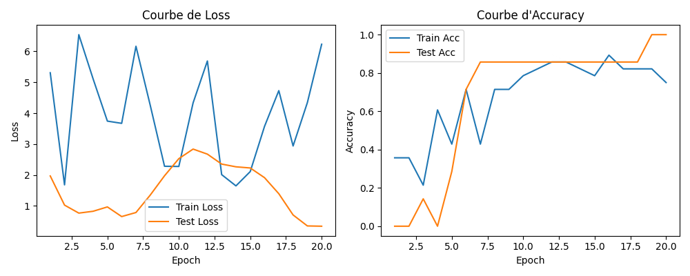
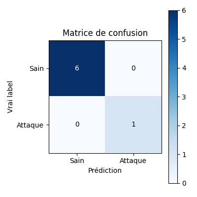
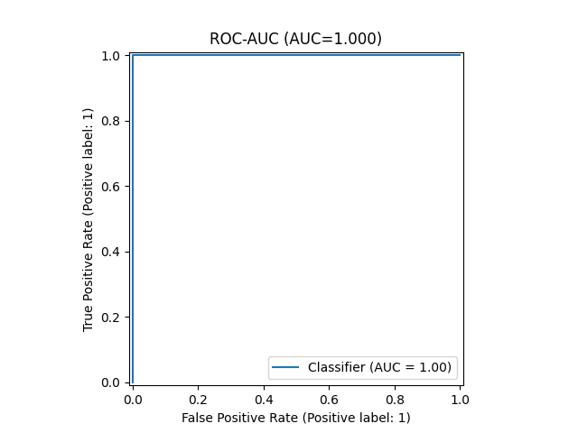
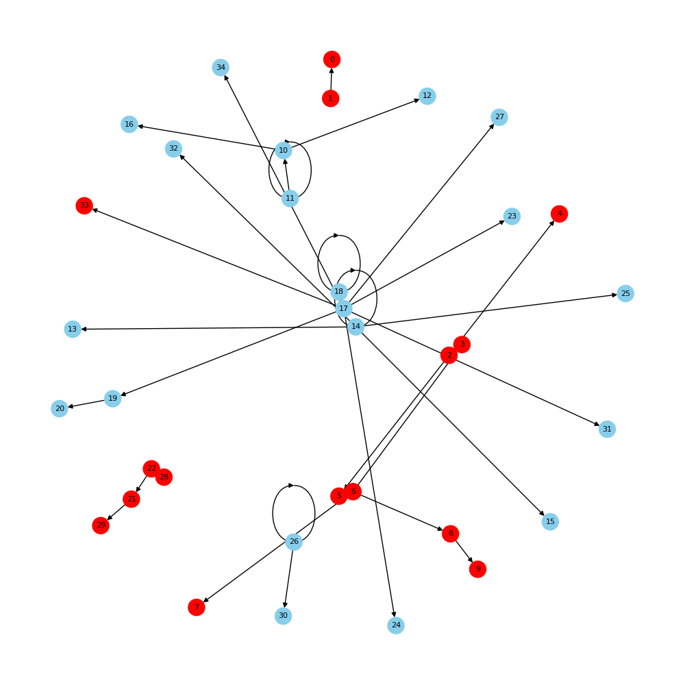

# GNN - CyBrain Detection System

## Overview

Ce projet implémente un système de détection d'anomalies basé sur les Graph Neural Networks (GNN) pour identifier les comportements malveillants dans les processus système. Le modèle analyse les relations entre les processus pour détecter les attaques potentielles.

## Architecture du Modèle

### Structure du Réseau
- **Type**: Graph Convolutional Network (GCN)
- **Tâche**: Classification binaire au niveau des nœuds (Node Classification)
- **Architecture**: 
  - 2 couches de GCNConv (64 neurones cachés)
  - Couche linéaire de sortie (1 neurone)
  - Dropout: 0.3
  - Activation: ReLU

### Features des Nœuds
Chaque nœud (processus) est caractérisé par:
- `binary_id`: Identifiant encodé du nom du binaire
- `uid`: User ID du processus
- `args_count`: Nombre d'arguments du processus

## Entraînement du Modèle

### Dataset
- **Source**: `data/processed/bad_graph_gnn.json`
- **Structure**: Graphe unique avec nœuds et liens
- **Split**: 80% entraînement, 20% test (stratifié)
- **Tâche**: Détection binaire (Sain vs Attaque)

### Hyperparamètres
- **Époques**: 20
- **Batch size**: 16
- **Learning rate**: 1e-3
- **Optimiseur**: Adam
- **Loss**: Binary Cross-Entropy with Logits
- **Device**: GPU (CUDA) si disponible, sinon CPU

### Processus d'Entraînement
1. **Prétraitement**: Encodage des noms de binaires avec LabelEncoder
2. **Construction du graphe**: Création des matrices de features et d'adjacence
3. **Entraînement**: Optimisation des poids du réseau
4. **Évaluation**: Calcul des métriques de performance à chaque époque
5. **Sauvegarde**: Conservation du meilleur modèle (basé sur le F1-score)

## Performances du Modèle

### Courbes d'Apprentissage


Les courbes montrent l'évolution de la loss et de l'accuracy pendant l'entraînement. On observe une bonne convergence avec une généralisation correcte sur le set de test.

### Matrice de Confusion


La matrice de confusion illustre la performance du modèle sur les données de test:
- **Vrais Positifs**: Attaques correctement détectées
- **Vrais Négatifs**: Processus sains correctement identifiés
- **Faux Positifs**: Processus sains incorrectement flaggés
- **Faux Négatifs**: Attaques manquées

### Courbe ROC-AUC


La courbe ROC et l'AUC (Area Under Curve) mesurent la capacité du modèle à distinguer entre les classes positives et négatives. Un AUC proche de 1.0 indique une excellente performance de classification.

### Visualisation du Graphe d'Attaque


Cette visualisation montre:
- **Bleu**: Processus sains
- **Orange**: Cibles d'attaque réelles (ground truth)
- **Rouge**: Anomalies détectées par le modèle

## Explicabilité (XAI)

Le système inclut une fonctionnalité d'explicabilité utilisant GNNExplainer pour:
- Identifier les nœuds les plus importants dans la détection
- Mettre en évidence les arêtes critiques
- Fournir une interprétation des décisions du modèle

## Mapping MITRE ATT&CK

Le système intègre un mapping avec les techniques MITRE ATT&CK:
- **Source**: `data/mitre_stix_mapping.json`
- **Utilisation**: Association des anomalies détectées aux techniques d'attaque
- **Exemple**: T1003 (Credential Dumping) pour les attaques de type credential access

## Utilisation

### Entraînement du modèle
```bash
python train_gnn.py
```

### Sorties générées
- `model_output/gnn_cybrain.pth`: Modèle entraîné
- `model_output/learning_curves.png`: Courbes d'apprentissage
- `model_output/confusion_matrix.png`: Matrice de confusion
- `model_output/roc_auc.png`: Courbe ROC-AUC
- `model_output/attack_graph_example.png`: Visualisation du graphe
- `model_output/explication_mitre.png`: Explication XAI

## Dépendances

- PyTorch & PyTorch Geometric
- NetworkX
- scikit-learn
- matplotlib
- numpy
